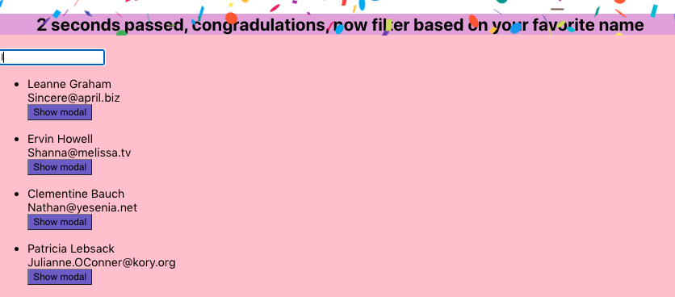

# Single-page app using React

   

This app provides a platform to have access to Users API(API_URL:http://jsonplaceholder.typicode.com/users) and getting the information using axios in React and make the them available. This App has a configurable delay function mechanism so that the list of API is available and then after 2 seconds there will be a search bar available with a filter option so that the result will be based on the search entered in the search bar. Each List has a Modal pop up option for a Detail view. There is also a side-out panel available in order to store favorites. The slide-out files are SlideOut.js and SlideOut.css (there is a rotation degree available in order to rotate the slide view to whatever degree desired) in the components folder.

To design the app an animation is used at the beginning of the app which machets the delay function implemented the duration of the delay is set to 2s and is configurable. The app also uses react-confetti which welcomes the users after waiting time(delay) is over.

  

## Available Scripts

In the project directory, you can run:

### `npm init creat-react-app name-of-the-app`
creates the react app

in Terminal ->> cd into the app-folder

### `npm start`

Runs the app in the development mode.
Open [http://localhost:3000](http://localhost:3000) to view it in the browser.

The page will reload if you make edits.

### `Technologies`
 React
 
 React-Hooks--->useState, useEffect, useModal...

JS

CSS

HTML

### `packages and extentions`
axios

react-confetti

@ijsto/react-slideout

react-modal

react-modal-hook

Typescript-->(npm install -g typescript-> tsc --version(to doublecheck the installation is successful)) 

Es7 React/Redux/GraphQL/React-Native extension

### Deployment

Git/GitHub--->

### Typescript
Since Ts is superset of Js every file written in Js is convertable:

1- Add tsconfig. json file to project ( after installing the tsc and version check---> tsc --init -->Successfully created a tsconfig.json file)

2- In tsconfig.json find set "allowJs" to true, set "outDir" to "dist"(The directory to keep the files generated by ts compiler)

3- Ready to go (tsc in terminal) and the dist folder will be generated and use the dist/app.js as the src of the scipt line in index.html file 

